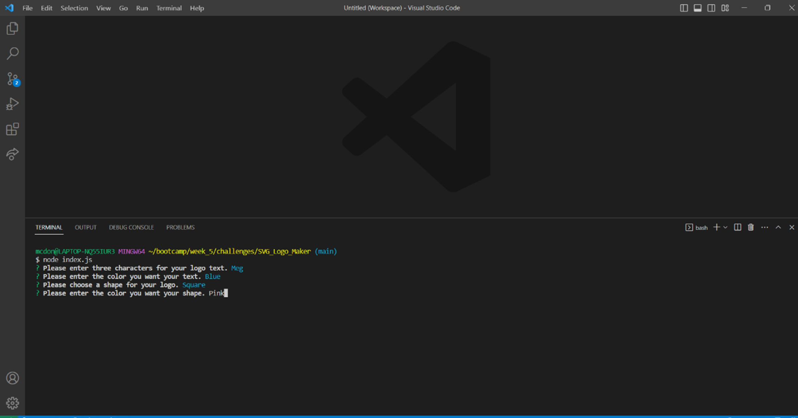
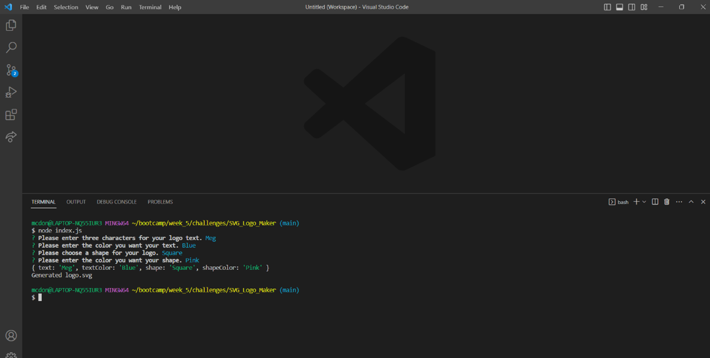
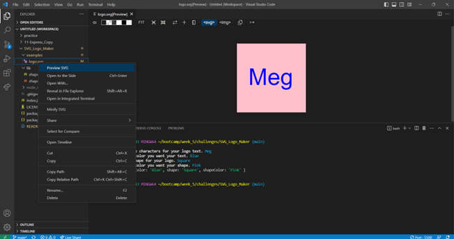
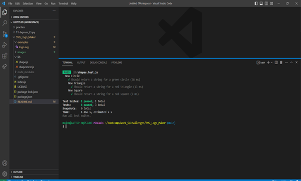

# SVG Logo Maker

## Description

This application is used to generate an SVG Logo. The logo is created by user input. The user is presented with the following questions:

1.  Entering text for logo
2.  Text Color
3.  Choice of shape - circle, triangle, or square
4.  Shape Color

## Table of Contents

- [Installation](#installation)
- [License](#license)
- [Usage](#usage)
- [ScreenShots](#screenshots)
- [Video](#video)
- [Links to Deployment](#linkstodeployment)
- [Credits](#LinkstoDeployment)
- [Contribution](#contribution)
- [Tests](#tests)
- [Questions](#questions)

## Installation

1.  npm init
2.  npm i jest
3.  npm i inquirer

## License

MIT

## Usage

1.  Run node index.js
2.  Answer each prompt
3.  Right click logo.svg and click open in preview
4.  Run npm test to test

## ScreenShots

## Video

https://drive.google.com/file/d/1-3Lqoqdl4SPgM4HVS9Af1jGAjYsWvJ3r/view?usp=sharing

## Links to Deployment

https://github.com/MegMathis/SVG_Logo_Maker

## Credits

https://www.youtube.com/watch?v=mAP5Kw1W_FE

https://www.npmjs.com/package/inquirer-maxlength-input-prompt

https://www.npmjs.com/package/inquirer

https://www.w3schools.com/js/js_switch.asp

https://marketplace.visualstudio.com/items?itemName=jock.svg

https://www.w3.org/TR/SVG11/

https://developer.mozilla.org/en-US/docs/Web/SVG/Tutorial/Texts

https://www.w3schools.com/html/html5_svg.asp

## Contribution

Megan Mathis

## Tests

npm test

## Questions

Any questions, please contact me at:

- GitHub:
  [MegMathis](http://github.com/MegMathis)
- Email:
  [mcdonough.megan25@gmail.com](mailto:mcdonough.megan25@gmail.com)
